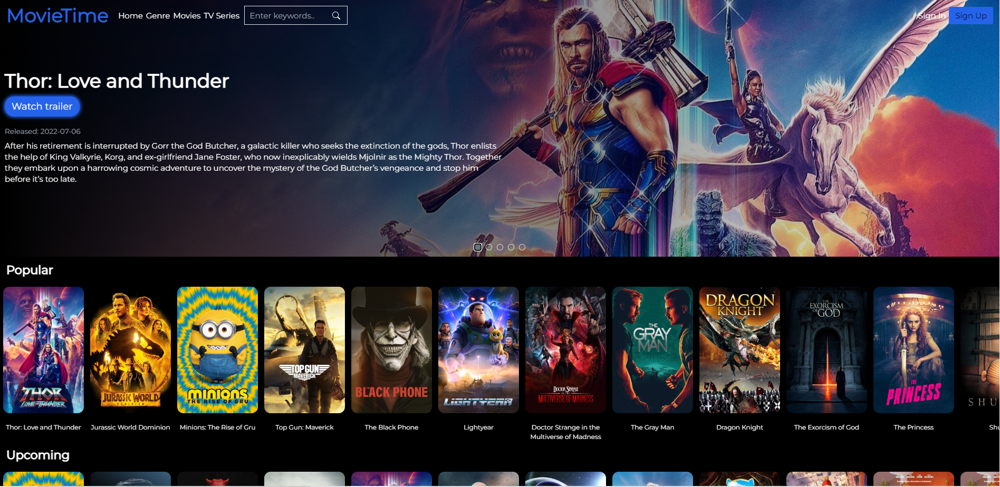
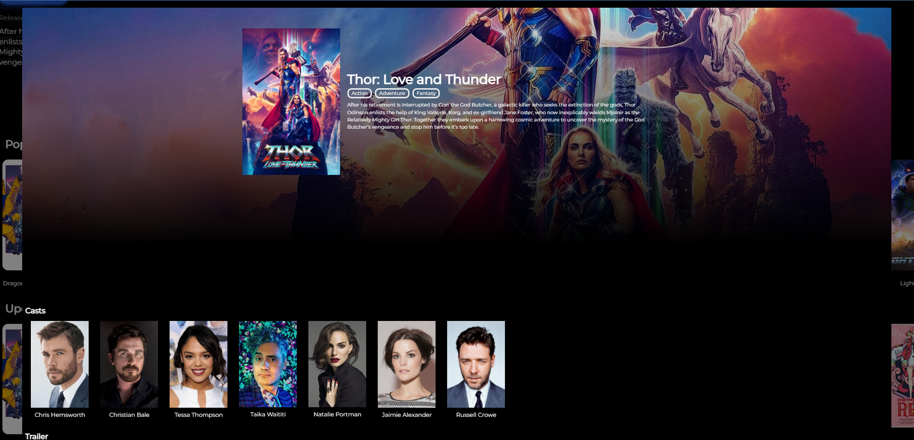
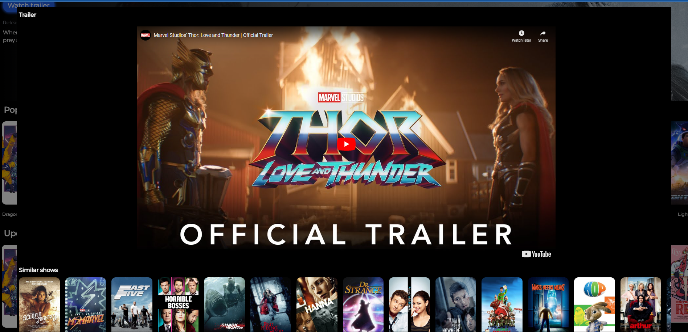
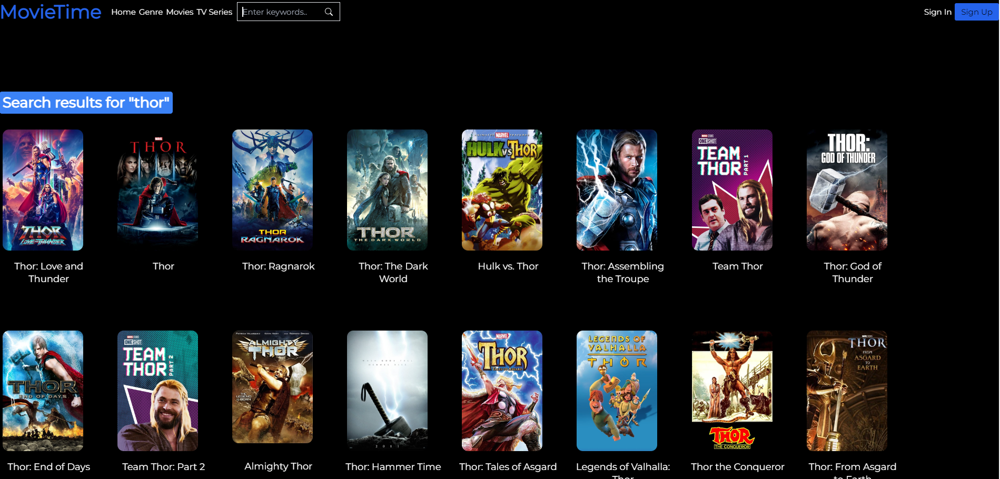

# 
# MovieTime - Movie Searching App

Movie and TV Series searching app created with ReactJS, Firebase, Tailwind and TMDB api. It helps finds user the movie they are looking for with keywords and they could find movies with genres. 

## Table of Contents
* [General Info](#general-information)
* [Technologies Used](#technologies-used)
* [Features](#features)
* [Preview](#preview)
* [Setup](#setup)
* [Room for Improvement](#room-for-improvement)
* [Acknowledgements](#acknowledgements)
* [Contact](#contact)

## Demo

Live demo [here](https://movie-app-4fdd2.web.app)

## General Info
My initial intention for this project is to replicate a simple front-end of most the popular streaming service app, Netflix, but I enjoyed working on it so I added more features. My goal for this project is to help users to find movies that they like with keywords and find movies and TV series with genres that they like. 

## Technologies Used
ReactJS 18.1.0 - a front-end Javascript library used for building user interfaces for single-page applications

Firebase 9.8.1 - a cloud-hosted NoSQL database that lets you store and sync data between your users in realtime

Tailwind - utility-first framework to help builders implement styles quicker

TMDB api v3 - movie and TV database that lets you find all movies and TV and know more about them

## Feature
-By clicking on the movie that you like, you can watch a trailer to prepare you before you watch the actual movie
-You can also see which actors are in the movie and similar movies that matches the genre of the movie
-Home page and each genre page will show you popular, trending, upcoming movies and TV series titles

## Preview

## Setup
Clone this repo to your pc and run npm install to install all dependencies to get started with the project

## Room for Improvement
Areas that could be improved in future development
-Styles (more colours and UI design)
-Fetching speed 
-More cleaning in code

## Acknowledgements
[This](https://github.com/fireclint/netflix-react-tailwind) and [this](https://github.com/trananhtuat/react-movie) repos help me to get started in my journey to build this project and I would like to thank them fully.

## Contact
Feel free to contact me on my [LinkedIn](https://www.linkedin.com/in/william-cadiz-83b541195/) and ask me anything. I'm a growing developer and feedbacks are like my food to get stronger and better developer!

